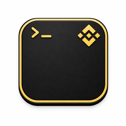

<div align="center">


# cmux

**Native macOS AI Terminal + WEA Bot**

A Ghostty-based native macOS terminal with integrated Difft (WEA) IM Bot, bringing AI coding agents to your fingertips.

[](https://github.com/manaflow-ai/cmux/releases/latest/download/cmux-macos.dmg)

</div>

---

## Table of Contents

- [Overview](#overview)
- [Features](#features)
- [Install](#install)
- [WEA Bot Integration](#wea-bot-integration)
  - [Bot Application Process](#bot-application-process)
  - [Configuration](#configuration)
  - [Architecture](#architecture)
- [CLI Commands](#cli-commands)
- [Keyboard Shortcuts](#keyboard-shortcuts)
- [Development](#development)

---

## Overview

cmux is a native macOS terminal app built with Swift/AppKit, powered by libghostty for GPU-accelerated rendering. On top of standard terminal capabilities, cmux integrates a Difft (WEA) IM Bot: users @mention the Bot in WEA chats, and cmux automatically routes messages to a dedicated Claude Code session, returning AI responses as interactive card messages in real time.

**Philosophy:** The terminal is the best host for AI coding agents. cmux provides composable primitives (terminal, browser, notifications, WEA Bot, CLI) instead of a rigid workflow.

---

## Features

### Terminal

<table>
<tr>
<td width="40%" valign="middle">
<h4>Notification Rings</h4>
Panes get a blue ring and tabs light up when AI agents need your attention
</td>
<td width="60%">

</td>
</tr>
<tr>
<td width="40%" valign="middle">
<h4>Built-in Browser</h4>
Split a browser alongside your terminal with a scriptable API ported from <a href="https://github.com/vercel-labs/agent-browser">agent-browser</a>
</td>
<td width="60%">

</td>
</tr>
<tr>
<td width="40%" valign="middle">
<h4>Vertical + Horizontal Tabs</h4>
Sidebar shows git branch, PR status, working directory, listening ports, and latest notification
</td>
<td width="60%">

</td>
</tr>
</table>

- **Native macOS** -- Swift + AppKit, not Electron. Fast startup, low memory.
- **GPU-accelerated** -- Powered by libghostty for smooth rendering
- **Ghostty compatible** -- Reads your existing `~/.config/ghostty/config` for themes, fonts, and colors
- **Scriptable** -- CLI + Socket API to control workspaces, panes, browser, and keystrokes

### WEA Bot

- **Session isolation** -- Group chats keyed by `groupId`, DMs by `senderWuid`, each with its own Claude Code process
- **Independent workspaces** -- Each session gets its own workspace directory and `CLAUDE.md`, giving Claude full file read/write capabilities
- **Interactive cards** -- Difft CARD + REFRESH mechanism for streaming output; users see Claude's real-time thinking process
- **WebSocket real-time** -- Difft WebSocket API for instant message reception with low-latency response
- **File/image sending** -- Client-side encrypted upload, supports screenshot sending (`cmux screenshot` + `cmux wea send-file`)
- **Group blacklist** -- Configurable per-group blocking
- **Auto-reconnect** -- WebSocket auto-reconnects on disconnect, crashed processes auto-recover
- **Smart message splitting** -- Long replies split at paragraph/line/word boundaries, respecting Difft's 4KB limit

---

## Install

### DMG (Recommended)

<a href="https://github.com/manaflow-ai/cmux/releases/latest/download/cmux-macos.dmg">
  
</a>

Open the `.dmg` and drag cmux to your Applications folder. cmux auto-updates via Sparkle, so you only need to download once.

### Homebrew

```bash
brew tap manaflow-ai/cmux
brew install --cask cmux
```

To update later:

```bash
brew upgrade --cask cmux
```

### Build from Source

```bash
# 1. Clone with submodules
git clone --recurse-submodules https://github.com/manaflow-ai/cmux.git
cd cmux

# 2. Run setup (initializes submodules and builds GhosttyKit)
./scripts/setup.sh

# 3. Build Debug app (tag required for isolated build)
./scripts/reload.sh --tag my-build

# 4. Build and launch
./scripts/reload.sh --tag my-build --launch
```

Requirements for building from source:
- macOS 14+
- Xcode 15+
- [Zig](https://ziglang.org/download/) (for building GhosttyKit)

---

## WEA Bot Integration

### Bot Application Process

Before using the WEA Bot, you need to register a Bot on the Difft platform and obtain credentials.

#### Step 1: Search for IMBot

In the WEA client, search for **IMBot**:

| Environment | Search Target |
|------------|---------------|
| Test | IMBot (`+22288`) |
| Production | IMBot (`+10004`) |

#### Step 2: Apply for a Bot

Open the IMBot conversation, tap **Bot Menu** at the bottom, and select **"Bot Request"** / **"Apply a new bot"**.

#### Step 3: Fill Out the Application

| Field | Requirement | Example |
|-------|-------------|---------|
| **Bot Name** | Follow `[Prefix][Function][Suffix]` convention | `ConvertAIAssistant` |
| **Bot Signature** | Brief description, under 20 characters | `AI Coding Assistant` |
| **Bot Description** | Detailed description of the Bot's purpose | `Bridge between WEA IM and Claude Code` |
| **Service Type** | Select **"Extension Service"** | -- |

**Naming convention:**

- **Prefix** -- Department identifier (e.g., `Convert`, `HR`, `Infra`)
- **Function** -- Feature description (e.g., `AI`, `Recruitment`, `Monitor`)
- **Suffix** -- Type: `Bot`, `Robot`, `Assistant`, `Monitor`, `Notify`, `Auto`

Submit and wait for approval.

#### Step 4: Receive Credentials

Once approved, you'll receive:

- **AppID** -- Application identifier
- **BotID** -- Bot identifier
- **OTP** -- One-time password (valid for 24 hours)

#### Step 5: Exchange OTP for Secret

Use the OTP to obtain a permanent Secret (OTP expires in 24 hours):

**Production:**

```bash
curl --location 'https://openapi.difft.org/v2/token/secret' \
  --header 'Authorization: <your_otp>' \
  --header 'X-Signature-appid: <your_app_id>'
```

**Test:**

```bash
curl --location 'https://openapi.test.difft.org/v2/token/secret' \
  --header 'Authorization: <your_otp>' \
  --header 'X-Signature-appid: <your_app_id>'
```

Response:

```json
{
  "ver": 1,
  "status": 0,
  "reason": "ok",
  "data": {
    "app_secret": "Kxxxxxxxxxxxxxxxxxxxxxxxxx6"
  }
}
```

Save the `app_secret` for configuration.

#### Step 6: Enable WebSocket Permission

> **Critical step!** Without this permission, WebSocket connections will be rejected (HTTP 401).

1. Search for **DevOnWea** (`+20035`) in WEA
2. Request **WebSocket listening permission** from DevOnWea
3. Provide your **BotID** and **environment** (`test` / `production`)

---

### Configuration

In the cmux app, open **Settings > WEA Bot** to configure.

#### Bot Credentials

| Field | Description | Example |
|-------|-------------|---------|
| **App ID** | Application identifier assigned by Difft | `ver2341a46a60429f673` |
| **App Secret** | Permanent secret obtained via OTP (stored in Keychain) | `WKrUY/P6hMLdeP59...` |
| **Bot ID** | Bot identifier | `29705` |

#### Behavior Settings

| Field | Description | Default |
|-------|-------------|---------|
| **Auto Connect** | Automatically connect to WEA on app launch | `false` |
| **Sessions Root Path** | Root directory for session workspaces | `{cwd}/wea-sessions` |
| **Group Blacklist** | List of blocked group IDs | Empty |

#### Usage

- **Direct messages** -- Send a message directly to the Bot; it responds automatically
- **Group chats** -- @mention the Bot in a group (e.g., `@ConvertAIAssistant write a sorting algorithm`); the Bot only responds to @mentions

---

### Architecture

#### Data Flow

```
User (WEA Client)
    |
    v
Difft Platform --WebSocket--> WeaWebSocket     (HMAC-SHA256 auth, real-time message reception)
                                    |
                                    v
                              WeaBotService     (message parsing, @mention filtering, session routing)
                                    |
                                    +-- WeaSessionRegistry   (session-to-workspace mapping, persistence)
                                    |
                                    v
                              WeaWorkspaceManager -> cmux Workspace + Terminal Panel
                                    |
                                    v
                              WeaTerminalBridge  (message injection -> Claude Code, transcript monitoring)
                                    |
                                    +-- Claude Code processing --> text reply
                                    |
                                    v
                              WeaHttpClient      (TEXT / CARD / REFRESH / attachment sending)
                                    |
                                    +-- WeaFileUploader    (3-step encrypted upload: isExists -> PUT OSS -> uploadInfo)
                                    |   +-- WeaFileCrypto  (AES-256-CBC + HMAC-SHA256 + MD5)
                                    |
                                    v
                              Difft Platform --> User (sees reply / file in real time)
```

#### Session Isolation

| Chat Type | Session Key | Description |
|-----------|-------------|-------------|
| Group chat | `group:{groupId}` | All @Bot messages in a group share one Claude Code process |
| Direct message | `direct:{senderWuid}` | Each user gets a dedicated Claude Code process |

Each session has an independent workspace at `{sessionsRootPath}/{groupId}/`, containing:
- `CLAUDE.md` -- Session-level prompt that teaches Claude how to use cmux screenshot and file sending capabilities
- Full file system read/write access

#### File Sending Flow

```
Claude Code runs:
  cmux screenshot              -> /tmp/cmux-screenshots/xxx.png
  cmux wea send-file xxx.png   -> Socket: wea_send_file -> WeaBotService
                                  -> WeaFileCrypto.encrypt (AES-256-CBC)
                                  -> WeaFileUploader.upload (3-step)
                                  -> WeaHttpClient.sendAttachment
                                  -> WEA user receives image
```

#### HMAC-SHA256 Signing

All Difft API requests use HMAC-SHA256 signature authentication:

| Header | Description |
|--------|-------------|
| `X-Signature-appid` | AppID |
| `X-Signature-timestamp` | Millisecond timestamp |
| `X-Signature-nonce` | UUID (hyphens removed) |
| `X-Signature-algorithm` | Fixed `HmacSHA256` |
| `X-Signature-signature` | HMAC-SHA256 signature value (hex) |

---

## CLI Commands

cmux provides a CLI tool for scriptable control.

### General

```bash
cmux notify "message"              # Send notification to current terminal
cmux screenshot [label]            # Capture cmux window, returns image path
```

### WEA

```bash
# Send a file to the current WEA chat
cmux wea send-file <path>

# Send a file with a caption
cmux wea send-file /path/to/report.pdf --body "Here's the report"

# Take a screenshot and send it to WEA
cmux screenshot && cmux wea send-file /tmp/cmux-screenshots/*.png
```

> `cmux wea send-file` requires the `CMUX_WORKSPACE_ID` environment variable (automatically set in WEA session terminals).

### Workspace Management

```bash
cmux workspace list               # List all workspaces
cmux workspace select <id>        # Switch to a workspace
cmux workspace new [name]         # Create a new workspace
```

### Socket API

cmux exposes a Unix Domain Socket API (`/tmp/cmux-debug.sock`) for fine-grained control:

```bash
# Query current window info
echo "v1 window.current" | nc -U /tmp/cmux-debug.sock

# Send keystrokes to terminal
echo "v1 input.send {\"text\":\"hello\"}" | nc -U /tmp/cmux-debug.sock
```

---

## Keyboard Shortcuts

### Workspaces

| Shortcut | Action |
|----------|--------|
| ⌘ N | New workspace |
| ⌘ 1-8 | Jump to workspace 1-8 |
| ⌘ 9 | Jump to last workspace |
| ⌃ ⌘ ] / [ | Next / previous workspace |
| ⌘ ⇧ W | Close workspace |
| ⌘ ⇧ R | Rename workspace |
| ⌘ B | Toggle sidebar |

### Panes

| Shortcut | Action |
|----------|--------|
| ⌘ D | Split right |
| ⌘ ⇧ D | Split down |
| ⌥ ⌘ Arrow keys | Focus pane directionally |
| ⌘ T | New surface |
| ⌘ W | Close surface |

### Browser

| Shortcut | Action |
|----------|--------|
| ⌘ ⇧ L | Open browser in split |
| ⌘ L | Focus address bar |
| ⌘ [ / ] | Back / forward |
| ⌘ R | Reload page |
| ⌥ ⌘ I | Developer tools |

### Notifications

| Shortcut | Action |
|----------|--------|
| ⌘ I | Notification panel |
| ⌘ ⇧ U | Jump to latest unread |

### Terminal

| Shortcut | Action |
|----------|--------|
| ⌘ K | Clear scrollback |
| ⌘ C | Copy |
| ⌘ V | Paste |
| ⌘ F | Find |
| ⌘ + / - | Adjust font size |

---

## Development

### WEA Source Structure

```
Sources/Wea/
├── WeaBotService.swift          # Main service: lifecycle, message routing, session management
├── WeaBotConfig.swift           # Persistent config: AppID/BotID/Secret(Keychain), blacklist, session path
├── WeaWebSocket.swift           # WebSocket connection: signed auth, reconnect, heartbeat, message fetch
├── WeaHttpClient.swift          # HTTP API: TEXT/CARD/REFRESH/attachment message sending
├── WeaMessageParser.swift       # Message parsing: extract sender/group/content/mention
├── WeaTerminalBridge.swift      # Terminal bridge: message injection -> Claude Code, transcript monitoring
├── WeaSessionRegistry.swift     # Session registry: session->workspace mapping, file persistence
├── WeaWorkspaceManager.swift    # Workspace management: find/create workspace + terminal panel
├── WeaFileUploader.swift        # File upload: 3-step encrypted upload (isExists -> PUT -> uploadInfo)
├── WeaFileCrypto.swift          # Crypto utilities: AES-256-CBC + HMAC-SHA256 + MD5
├── WeaSignature.swift           # HMAC-SHA256 signing (matches @wea/wea-sdk-js)
└── WeaMessageDest.swift         # Message destination: user/group routing
```

### Building

```bash
# Initialize submodules and build GhosttyKit
./scripts/setup.sh

# Build Debug app (tag required)
./scripts/reload.sh --tag <tag>

# Build and launch
./scripts/reload.sh --tag <tag> --launch

# Compile check only
xcodebuild -project GhosttyTabs.xcodeproj -scheme cmux -configuration Debug \
  -destination 'platform=macOS' -derivedDataPath /tmp/cmux-<tag> build
```

### Tech Stack

| Technology | Purpose |
|------------|---------|
| **Swift / AppKit** | Native macOS UI |
| **libghostty (Zig)** | GPU-accelerated terminal rendering |
| **WebSocket** | Difft real-time message reception |
| **CommonCrypto** | AES-256-CBC file encryption, HMAC-SHA256 signing |
| **Sparkle** | Auto-updates |
| **Keychain** | Secure App Secret storage |

---

## License

cmux is open source under [AGPL-3.0-or-later](LICENSE).

For commercial licensing, contact [founders@manaflow.com](mailto:founders@manaflow.com).
